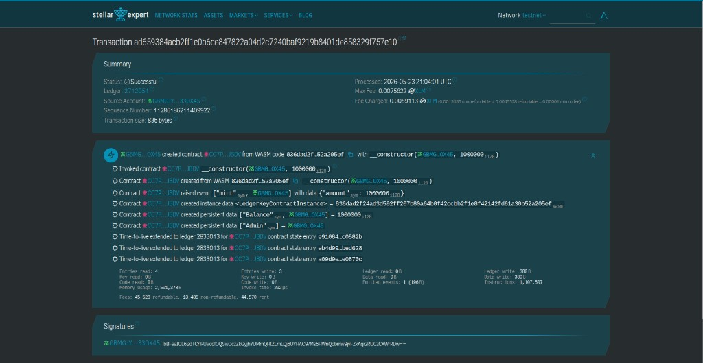

# Week 2 — SEP-41 Token (SibToken)

A Soroban smart contract that implements a fungible token following the [SEP-41](https://github.com/stellar/stellar-protocol/blob/master/ecosystem/sep-0041.md) token interface. Built for the Stellar Impact Bootcamp Week 2 assessment.

## Deployed contract (testnet)

| | |
|---|---|
| **Contract ID** | `CC7PAH37GW6UBWAIBFZ6EFUXW473Y5UXCIV6U3HDSAT5M5LS6IQ4JBDV` |
| **Network** | Stellar Testnet |
| **Deploy tx** | [ad659384…f757e10 on Stellar Expert](https://stellar.expert/explorer/testnet/tx/ad659384acb2ff1e0b6ce847822a04d2c7240baf9219b8401de858329f757e10) |
| **Explorer** | [View on Stellar Lab](https://lab.stellar.org/r/testnet/contract/CC7PAH37GW6UBWAIBFZ6EFUXW473Y5UXCIV6U3HDSAT5M5LS6IQ4JBDV) |

### Deployment proof (screenshot)

Successful testnet deploy: contract `CC7PAH37…JBDV` created, `__constructor` called with admin `GBMGJY…33OX45` and `initial_supply` of `1000000`, and a `mint` event crediting the admin balance.



## What this project does

The **SibToken** contract (`contracts/sep41-token`) is a custom fungible token with:

- **Deploy-time mint** — `__constructor(admin, initial_supply)` sets the admin and mints the initial supply to the admin address.
- **Admin mint** — `mint(to, amount)` lets the admin create more tokens after deployment.
- **SEP-41 operations** — `transfer`, `transfer_from`, `approve`, `allowance`, `balance`, `burn`, `burn_from`, plus `name`, `symbol`, and `decimals`.

Balances and allowances are stored on-chain. Transfers and burns require the correct account authorization; `transfer_from` and `burn_from` consume allowances.

On deployment, the constructor was called with `initial_supply` of **1,000,000** tokens minted to the admin wallet.

## Project structure

```text
.
├── contracts
│   └── sep41-token
│       ├── src
│       │   ├── lib.rs          # module root
│       │   ├── our_token.rs    # SibToken logic + constructor
│       │   ├── token_trait.rs  # SEP-41 trait definition
│       │   ├── storage.rs      # balances, allowances, admin
│       │   ├── events.rs       # Transfer, Approval, Burn, Mint
│       │   ├── error.rs
│       │   └── test.rs
│       └── test_snapshots/     # Soroban test ledger snapshots
├── docs/
│   └── deploy-testnet-proof.png
├── Cargo.toml
└── README.md
```

## Development

```bash
# Run tests
cargo test -p sep41-token

# Build WASM
stellar contract build --package sep41-token
```

## Interact with the deployed contract

Replace `mywallet` with your Stellar CLI identity that can sign for the admin account.

```bash
# Check admin token balance
stellar contract invoke \
  --id CC7PAH37GW6UBWAIBFZ6EFUXW473Y5UXCIV6U3HDSAT5M5LS6IQ4JBDV \
  --network testnet \
  --source mywallet \
  -- balance --id <ADMIN_G_ADDRESS>

# Token metadata
stellar contract invoke \
  --id CC7PAH37GW6UBWAIBFZ6EFUXW473Y5UXCIV6U3HDSAT5M5LS6IQ4JBDV \
  --network testnet \
  -- name
```

## Redeploy (optional)

To deploy a new instance on testnet:

```bash
stellar contract deploy \
  --wasm target/wasm32v1-none/release/sep41_token.wasm \
  --network testnet \
  --source mywallet \
  -- \
  --admin <G_ADDRESS> \
  --initial_supply 1000000
```

Each deploy creates a **new** contract ID (`C...`).
